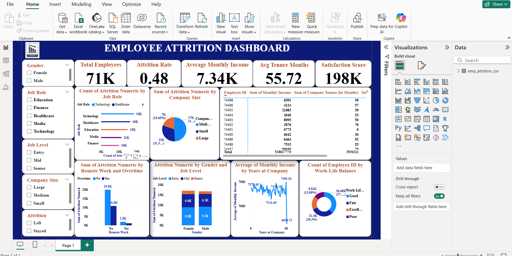

# 👨‍💼 Employee Power BI Dashboard

## 📊 Key Features

- 🏢 **Department-wise Employee Distribution**  
  Understand how workforce is spread across departments

- 📉 **Attrition Analysis**  
  Identify trends and factors contributing to employee churn

- ⭐ **Performance Ratings Overview**  
  Analyze employee performance metrics across various roles

- 💰 **Salary vs Experience Trends**  
  Correlate compensation with experience level

- 🎯 **Interactive Slicers**  
  Filter by Department, Job Role, Gender, Education, and more

## 🧠 Skills Demonstrated

- 🔧 Data transformation and modeling using **Power Query**
- 📐 Creating relationships and measures with **DAX**
- 🖼️ Designing clean and intuitive dashboards for business stakeholders
- 📊 Visual storytelling for **HR and leadership teams**
- 🧩 Use of calculated columns, KPIs, and conditional formatting
- 🔁 Dynamic filtering and time-based analysis

## 📝 How to Use
1. Download the `.pbix` file.
2. Open in Power BI Desktop (free download from Microsoft).
3. Explore and analyze the report.

## Screenshot

## 🎯 About This Project

This dashboard was built to demonstrate real-world HR analytics capabilities. Whether you're managing a large organization or exploring employee behavior patterns, this report helps answer critical questions like:
- Which departments have the highest attrition?
- How does experience influence salary?
- Where is talent concentrated across roles?

